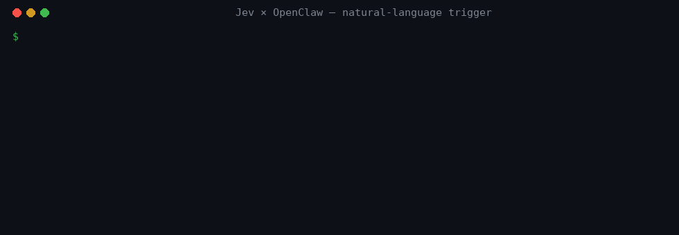

# Jev × OpenClaw

**Write your automation's trigger in plain language. Jev decides, every tick, whether it's time to wake the model.**



```sh
openclaw-jev-trigger --when "CI turned red" --not-when "CI is still running" \
  --exec "gh run list --limit 1 --json status,conclusion" > ci-red.js
openclaw automations add --every 5m --trigger-script ci-red.js \
  --message "CI went red. Find the failing job and propose a fix." --session isolated
```

`openclaw-jev-trigger` is an [OpenClaw](https://openclaw.ai) plugin. It adds one tool, `jev_when`, that asks the agent's **decision model** whether a condition written in ordinary words is true for what a watcher just observed. It also ships a small CLI that writes the trigger script for you.

- **Jev is the judge.** Calls go through OpenClaw's `decisionModel` role (`api.runtime.decisions.evaluate`), so hosted [Jev](https://typesafe.ai) (`typesafe/jev-latest`) is the default story. A local Kev server or a CPU ONNX classifier works too. You change one config line, not the code.
- **Quiet ticks cost nothing.** When the answer is "no", the automation returns `fire: false` and no conversation model runs. Only a "yes" wakes the model.
- **Measured, not claimed.** On 76 synthetic watcher ticks, hosted Jev got **75 right (99%)**, with **0 false wake-ups**, **231 ms** median, and about **$0.000016 per check**. A 5-minute watcher costs roughly **$0.14 a month** in Jev calls. The first-try JavaScript rules got 87%. [Details ↓](#benchmark)
- **Conditions that JavaScript is bad at.** "The work in this thread is finished, not just paused waiting for CI." "The price went down, not just a new sale banner."

> 🤖 **Built with AI.** The code, tests, benchmark data, and this README were written by an AI coding agent (Claude Code, Claude Opus 5.5), then run and checked on a real OpenClaw 2026.9.6 Gateway. All benchmark data is synthetic and made up for this repo.

[日本語はこちら ↓](#日本語)

---

## Why this exists

Coding agents like Claude Code, Codex, and Pi do their work while a session is running. OpenClaw also has a **scheduler that the Gateway owns**: [automations](https://docs.openclaw.ai/automation/cron-jobs/schedules) with *condition triggers*. A small headless script runs on every tick. It returns `{ fire: false }` to stay quiet, or `{ fire: true, message }` to start a real agent turn. That quiet tick is the place for a fast, cheap judge like Jev. You don't want to pay for a full model turn every five minutes just to learn "not yet".

The catch: today you write those conditions in JavaScript. Some conditions are easy in JavaScript: `conclusion === "failure"`. Others are about *meaning*, and a regex can't read meaning.

**This plugin started from a real problem.** We run chat agents that each work in their own thread. We wanted a watcher to tell us when a thread was **really finished**, as opposed to *paused*: "PR opened, waiting for CI", "done with step 1 of 3", "should I merge?". We wrote it in JavaScript and had to rebuild it **three times in two days**. Every new way of saying "done" or "not done yet" broke it. Now the condition is one sentence:

```sh
--when "The work in this thread is finished and the assistant has delivered its final result" \
--not-when "The assistant is only paused: waiting for a reply, an approval, a CI run, or a background job, or it is still working"
```

## How it works

```
every tick (Gateway scheduler, no model)
  └─ trigger script
       ├─ observe:  exec / web_fetch / any tool   → evidence (+ last run's, for "changed/dropped")
       ├─ judge:    jev_when({ when, notWhen, evidence, previous })
       │              └─ api.runtime.decisions.evaluate → agent's decisionModel
       │                   (typesafe/jev-latest · typesafe/kev-latest · onnx/…)
       └─ return:   { fire: p ≥ threshold && it wasn't already true, message, state }
                        │
          fire: false ──┴── fire: true → your --message runs as a normal agent turn
          (nothing else happens)            with the observation attached
```

`jev_when` sends a single **Boolean** decision (Jev calls it *Noul*). The **state** is the observation. The two **criteria** are your `when` and `notWhen`. The answer is `probabilityTrue`. The tool returns:

```json
{ "matched": true, "probability": 0.97, "threshold": 0.7, "model": "jev-…", "provider": "typesafe",
  "unavailable": null, "latencyMs": 180, "inputTokens": 95, "truncated": false }
```

The generated script adds the parts that are easy to get wrong:

| Behaviour | Default | Flag |
|---|---|---|
| Fire only when the condition *becomes* true (edge), not on every tick while it stays true | on | `--level` fires every matching tick |
| Pass last run's observation, for "dropped", "changed", "went up" | off | `--compare` |
| "The judge was unavailable" is **not** treated as "no". It stays quiet, but fires one alert after N misses in a row, so a broken watcher doesn't look healthy | 3 | `--alert-after <n>` (0 = never) |
| Long evidence is cut from the end you care about | tail | `--keep head` |

Edit the generated `.js` freely. It is plain code.

## Install

Requires **OpenClaw ≥ 2026.9.6** (the release that shipped the `decisionModel` role) and Node 24.16+.

```sh
# 1. The judge: hosted Jev (or see "Other judges" below)
openclaw plugins install @openclaw/typesafe
openclaw secrets store set TYPESAFE_API_KEY          # hidden prompt
openclaw config set plugins.entries.typesafe.config.apiKey \
  '{"source":"store","provider":"default","id":"TYPESAFE_API_KEY"}' --json
openclaw config set plugins.entries.typesafe.enabled true --json
openclaw config set agents.defaults.decisionModel '"typesafe/jev-latest"' --json

# 2. This plugin (from a clone, until it is on ClawHub)
git clone https://github.com/yousan/openclaw-jev-trigger && cd openclaw-jev-trigger
npm ci && npm run build && npm pack
openclaw plugins install npm-pack:./openclaw-jev-trigger-0.1.0.tgz --accept-capabilities

# 3. The CLI that writes trigger scripts
npm link        # or: node dist/cli.js …
```

Try the judge directly, without an automation:

```sh
curl -s http://127.0.0.1:18789/tools/invoke -H "Authorization: Bearer $OPENCLAW_GATEWAY_TOKEN" \
  -H 'content-type: application/json' \
  -d '{"tool":"jev_when","args":{"when":"The latest CI run has failed","evidence":{"status":"completed","conclusion":"failure"}}}'
```

## Examples

Ready-made scripts are in [`examples/`](examples/). Generate your own with `openclaw-jev-trigger --help`.

**"This thread is done"**: the story above ([`examples/thread-done.js`](examples/thread-done.js))

```sh
openclaw-jev-trigger \
  --when "The work in this thread is finished and the assistant has delivered its final result" \
  --not-when "The assistant is only paused: waiting for a reply, an approval, a CI run, or a background job, or it is still working" \
  --exec "tail -n 4 ./thread.log" > thread-done.js
```

**"CI turned red"** ([`examples/ci-red.js`](examples/ci-red.js)). Honestly, for clean JSON like this, a one-line JavaScript check is just as good (see the benchmark). Use `jev_when` when the status comes as prose, mixed formats, or from several CI systems.

**"The price on this page went down"** ([`examples/price-drop.js`](examples/price-drop.js))

```sh
openclaw-jev-trigger \
  --when "The product's price went down compared with the previous observation" \
  --not-when "The price is the same or higher, or only the wording, layout, stock, or shipping changed" \
  --fetch "https://shop.example/products/trail-runner-5" --compare --level > price-drop.js
openclaw automations add --every 1h --trigger-script price-drop.js --message "The price dropped. Tell me the new price and the old one."
```

## Benchmark

76 hand-written, **synthetic** watcher ticks in [`bench/cases.jsonl`](bench/cases.jsonl) (English and Japanese, half should fire and half shouldn't). The "shouldn't fire" cases are look-alikes on purpose: "waiting for CI", "done with step 1 of 3", "sale ends TODAY" with no price change. Every model row went through a live OpenClaw 2026.9.6 Gateway: `POST /tools/invoke` → `jev_when` → `decisions.evaluate` → the configured decision model. Nothing was mocked. Threshold 0.7.

| judge | all (n=76) | thread-done | ci-red | price-drop | false wakes | missed | p50 / p95 latency | $ per check |
|---|---|---|---|---|---|---|---|---|
| jev-latest (`jev-1.13.0`) | **99%** | 100% | 95% | 100% | 0 | 1 | 231 / 291 ms | $1.6e-5 (387 tok) |
| js-baseline | **87%** | 78% | 85% | 100% | 5 | 5 | <1 ms | $0 (local) |
| onnx-deberta-zeroshot (`deberta-v3-base-zeroshot-v2.0`) | **83%** | 94% | 90% | 63% | 5 | 8 | 416 / 901 ms | $0 (local) |
| onnx-gliclass-edge (`gliclass-edge-v3.0`) | **54%** | 59% | 50% | 50% | 22 | 13 | 60 / 117 ms | $0 (local) |

- **false wakes** = the model would have been woken for nothing. **missed** = it should have fired and didn't.
- Latency is `decisions.evaluate` time measured inside the tool, one request at a time. Hosted Jev latency includes the network round trip from the test machine to TypeSafe. Calling the tool through the Gateway (`wallMs` in the results) adds about 19 ms more (median).
- Cost: hosted Jev bills input tokens only, at $0.042 per million ([TypeSafe pricing](https://www.eesel.ai/blog/typesafe-jev-pricing)). The token count is what the provider reported. ONNX runs on your own CPU.
- `js-baseline` is [the kind of rule you write first](bench/baseline.mjs): done-words in the last message, the first status token, the first number on the price line. It is no strawman. On structured data (price, CI JSON) it does well, and that is the point: **use JavaScript for fields and `jev_when` for meaning.**
- The data is small and was written by the same agent that wrote the plugin. Treat the numbers as a smoke test, not a leaderboard. Re-run it on your own data: `node bench/run.mjs --label mine && node bench/report.mjs --detail`.

**The one Jev miss (`ci-07`)** is arguably a bad label on our side. The newest run in that case is an in-progress run on a feature branch, and the failed run on `main` is older. We left the label as it was written before the run, instead of fixing data after seeing the scores.

**What the benchmark caught.** The first version put the condition into the question's `instructions` *and* into the true label. Entailment-style models then saw the hypothesis written inside the premise and said "yes" to everything: **50%, every case above p = 0.93**. The condition now lives only in the two labels ([`src/rubric.ts`](src/rubric.ts)), and there is a unit test for that.

## Other judges

Point `agents.defaults.decisionModel` (or one agent's `decisionModel`) at another provider. The plugin and your scripts stay the same.

| decisionModel | Where it runs | Notes |
|---|---|---|
| `typesafe/jev-latest` | TypeSafe (hosted) | The main target. Evidence is **sent to TypeSafe**, so don't watch secrets or personal data. |
| `typesafe/kev-latest` | your GPU / Apple Silicon ([Kev](https://github.com/jaredpalmer/kev)) | Set `plugins.entries.typesafe.config.baseUrl` to `http://127.0.0.1:8009`. The data stays local. *Not measured here: no GPU on the test box.* |
| `onnx/deberta-v3-base-zeroshot-v2.0` | CPU, `@openclaw/onnx` | Free and offline. See the table for quality. Evidence has a 512-token limit: set `plugins.entries.jev-trigger.config.maxEvidenceChars` to ~1200. |
| `onnx/gliclass-edge-v3.0` | CPU | Fast, but it can't tell these conditions apart (near chance). |

Plugin config (`plugins.entries.jev-trigger.config`): `threshold` (0.7), `timeoutMs` (10000), `maxEvidenceChars` (4000).

## Safety notes

- A trigger script runs **without anyone watching**, with the owning agent's tool policy, including `exec`. Keep the observe step read-only and put actions in the `--message` turn.
- A "yes" from the judge is **evidence, not permission**. It starts your agent turn and nothing else.
- `unavailable` (timeout, no credentials, overloaded) never counts as "no". The script stays quiet and alerts after `--alert-after` misses.
- With hosted Jev, the observation leaves your machine. Use Kev or ONNX for private data.

## Develop

```sh
npm ci && npm run build && npm test          # unit tests, including running generated scripts
npm run plugin:validate                      # manifest ↔ entry check (openclaw plugins validate)
node bench/run.mjs --baseline                # JS rules, no Gateway needed
OPENCLAW_GATEWAY_URL=… OPENCLAW_GATEWAY_TOKEN=… node bench/run.mjs --label <name>
OPENCLAW="openclaw --profile scratch" ./demo/record.sh > demo/transcript.txt && python3 demo/render.py
```

Test against a **throwaway profile** (`openclaw --profile scratch …`), not your daily agent.

---

## 日本語

**OpenClaw の定期実行（automations）の発火条件を、ふつうの文章で書けるようにするプラグインです。** 毎回の見張りで「いま起こすべきか」を Jev が判定します。当たったときだけ会話のモデルが動きます。

- 条件の例: 「このスレッドの作業が終わったら（CI 待ちで止まっているだけのときは除く）」「CI が赤になったら」「このページの値段が下がったら」
- 判定は OpenClaw 9.6 の **判定モデルの役割（`decisionModel`）** を通して呼びます。本命はホスト版 Jev（`typesafe/jev-latest`）です。手元の Kev や CPU の ONNX 分類器にも、設定1行で切り替えられます
- 「いいえ」の回は `fire: false` を返すだけなので、会話のモデルは動かず、その分の料金もかかりません
- **Claude Code・Codex・Pi は、セッションが動いている間に仕事をします。** OpenClaw には Gateway 側の定期実行と「条件トリガー」があります。モデルを起こさない見張りの回が毎回あるので、Jev のような速くて安い判定がちょうど合います。つまり **OpenClaw ならではの Jev の使い方** です

**きっかけ（実話）:** チャットのエージェントがスレッドごとに作業する運用で、「そのスレッドが本当に終わったのか、CI やこちらの返事を待って止まっているだけか」を知らせる見張りを JavaScript で書きました。言い回しが変わるたびに外れ、**2日で3回作り直しました**。いまは上の `--when` / `--not-when` の2文だけです。

**使い方:** 上の「Install」と「Examples」を見てください。`openclaw-jev-trigger --when "…" --exec "…" > watch.js` で条件スクリプトを作り、`openclaw automations add --trigger-script watch.js` に渡します。

**計測:** 作り例のデータ 76 件（英語と日本語、発火すべき回・すべきでない回が半々）を、本物の OpenClaw 2026.9.6 Gateway に通して測りました。**ホスト版 Jev は 75 件正解（99%）、無駄にモデルを起こした回 0、見逃し 1**、待ち時間の中央値 231ms、1回あたり約 $0.000016 でした（5分おきの見張りで月 $0.14 ほど）。最初に書く JavaScript のルールは 87%、CPU の ONNX（DeBERTa）は 83% です。JavaScript の素朴なルールは、値段や CI の JSON のような「形の決まったデータ」では十分に強い一方、「スレッドが終わったか」のような意味の判定で落ちます。**欄の値は JavaScript、意味は `jev_when`** という使い分けを勧めます。

**注意:**
- ホスト版 Jev では、観測した内容が TypeSafe に送られます。機密や個人情報の見張りには Kev か ONNX を使ってください
- 判定の「はい」は根拠であって、実行の許可ではありません
- 判定できなかった回（時間切れなど）は「いいえ」として扱いません。続いたら1回だけ知らせます

> 🤖 **AI で作りました。** コード・テスト・計測データ・この README は AI のコーディングエージェント（Claude Code / Claude Opus 5.5）が書き、実際の OpenClaw 2026.9.6 で動かして確かめました。計測データはすべて作り例です。

## License

MIT
